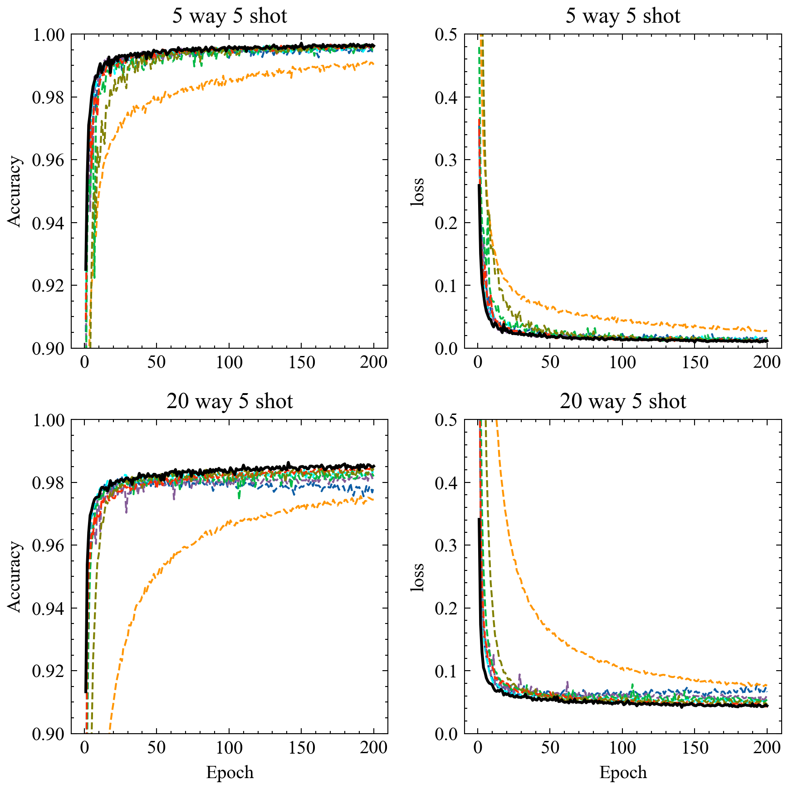

# Model-Agnostic Meta-Learning on omniglot

## Introduction

This repo is modified form the [project](https://github.com/tristandeleu/pytorch-maml).


In this framework, optimizers listed below are available:
- **0.Frankenstein**
- **1.Adam**
- **2.AMSGrad**
- **3.SGD**
- **4.RMSprop**
- **5.Lookahead(Adam)**
- **6.AdaBound**
- **7.Ranger**


## Getting started

```
python main.py data --taropt 0 --output-folder temp --dataset omniglot --num-ways 5 --num-shots 20 --use-cuda --step-size 0.1 --batch-size 64 --num-workers 2 --num-epochs 100 --meta-lr 2e-4 --output-folder to/results&

#taropt: the target optimizer id 0 for Frankenstein
```

## Result


